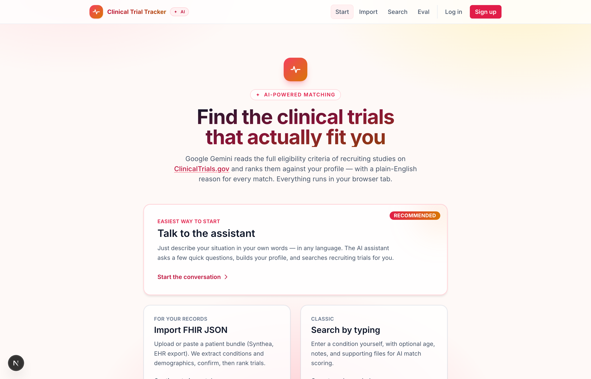
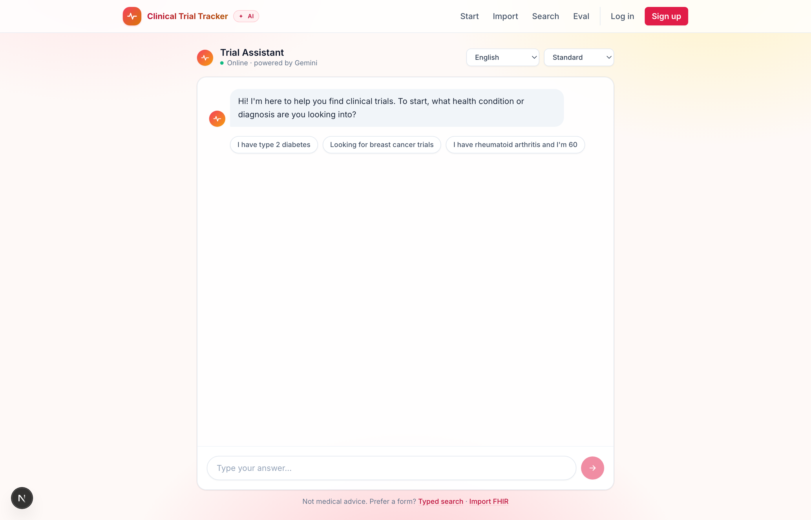
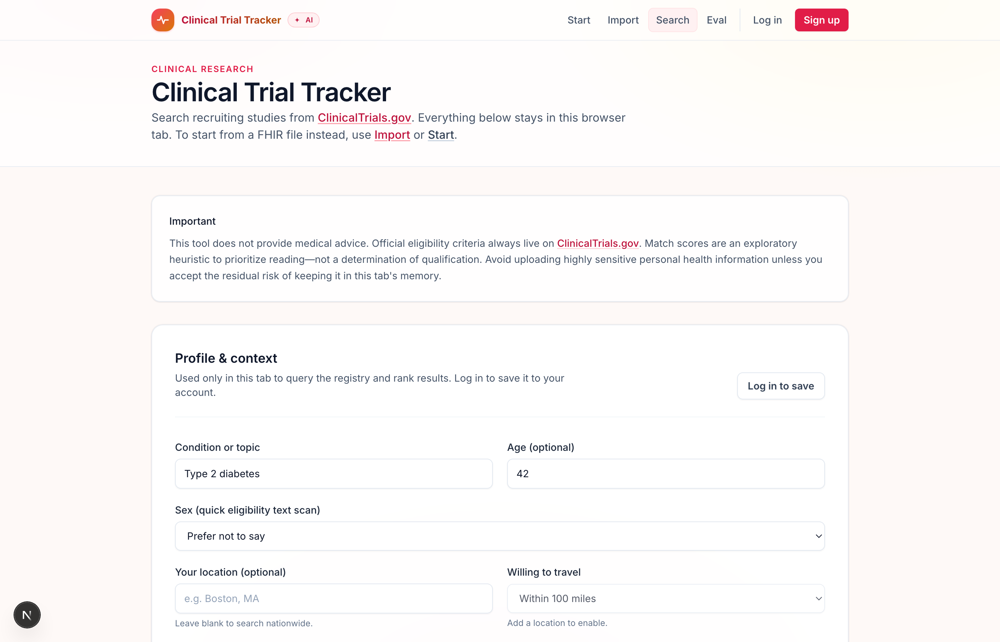
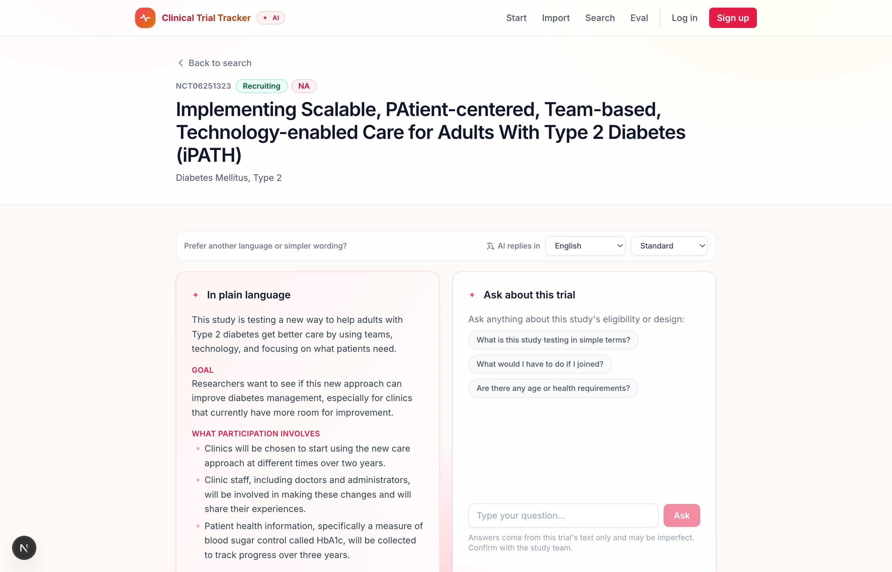
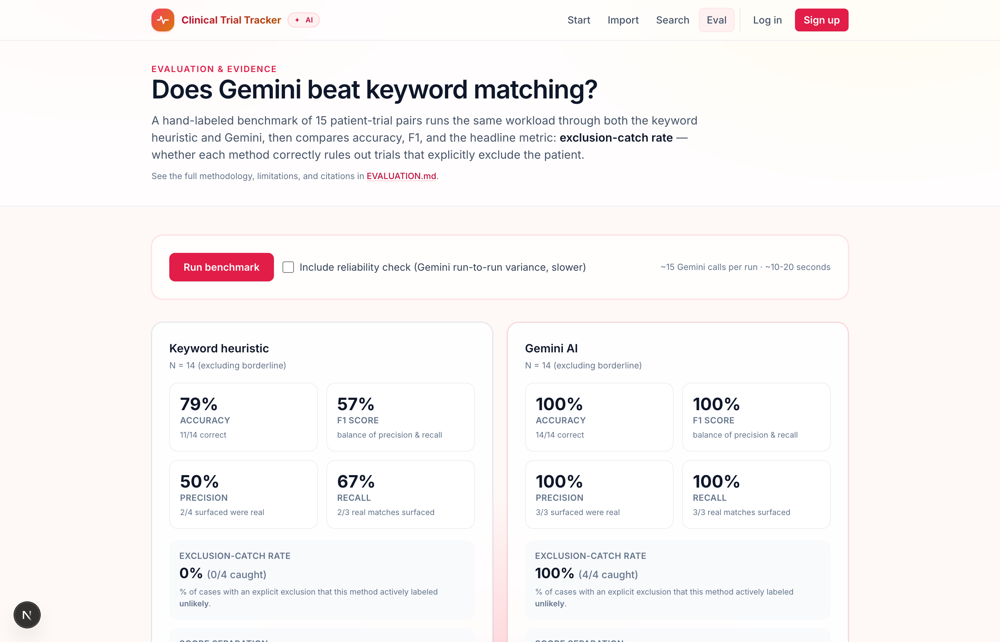

# Clinical Trial Tracker

**An AI-powered platform that helps patients find clinical trials they can actually join — in plain language, in any language, with a benchmark that proves it works.**



---

## Why this exists

Recruiting enough participants is **the leading cause of clinical trial delays and failures.** One published analysis of recently closed trials found that **nearly 1 in 5 cancer trials closed without ever meeting their accrual target**, and the broader literature consistently identifies patient recruitment as the largest single bottleneck in drug development.<sup>[1](#refs)</sup> Meanwhile, the eligibility criteria that determine who can join are written in dense clinical free text — designed for investigators, not patients — which creates a real access and equity barrier.<sup>[2](#refs)</sup>

The premise of this project is simple: a large language model can **read those criteria the way a careful human would**, in any language, and tell a patient in plain words whether a trial is likely a fit and *why*. A keyword search cannot.

That premise is testable, and **[this project tests it](#the-proof-an-ai-vs-keyword-benchmark) live in the app.**

---

## What's inside

> **One-line tour:** describe your situation in a chat → AI extracts your profile → live ClinicalTrials.gov search filtered by your location & travel distance → Gemini ranks each trial against your eligibility → click a trial for a plain-language explainer + a per-trial Q&A chat → save trials to a pipeline (Interested → Contacted → Applied) → print a one-page brief with AI-generated questions for your doctor.

### Conversational intake — describe your situation in your own words



The assistant interviews you a question at a time in plain language (and any of 12 languages), extracts a structured profile, then launches the search. No forms, no jargon.

### Live, filtered ClinicalTrials.gov search



Real recruiting trials, fetched from the [ClinicalTrials.gov v2 API](https://clinicaltrials.gov/data-api/api). Location-aware: enter your city and how far you'll travel, and the registry's geo filter only returns trials with a site in range (geocoded via the free, keyless [Open-Meteo](https://open-meteo.com/) API).

### Rich trial detail — with an AI explainer and Q&A chat



Each trial has a full detail page with phase, status, enrollment, sponsor, sites, and contacts pulled live from the registry — plus **Gemini-generated plain-language explainer** ("what this study is actually testing, in human terms") and a **per-trial Ask-AI chat** grounded only in that study's eligibility text. Toggle a language or "simple wording" mode and the AI re-renders.

### A printable patient brief

A one-page brief per trial — facts, plain-language summary, and **AI-generated questions to bring to your care team** — printable to PDF straight from the browser.

### Saved trials, profile, account control

Logged-in users get a persistent profile, a **saved-trial application pipeline** (Interested → Contacted → Applied with private notes), and an `/account` page to **export everything as JSON or CSV** — or delete the account entirely.

---

## The proof: an AI-vs-keyword benchmark

This is the part most class projects skip. There's a hand-labeled, live-runnable benchmark inside the app at **`/evaluation`** that compares Gemini against the keyword baseline on 15 patient-trial pairs across six categories.



A representative run against `gemini-2.5-flash-lite`:

| Metric | Keyword heuristic | Gemini AI |
|---|---:|---:|
| Accuracy | 79% (11/14) | **100%** (14/14) |
| F1 score | 0.57 | **1.00** |
| Precision / Recall | 50% / 67% | 100% / 100% |
| **Exclusion-catch rate** | **0%** (0/4 caught) | **100%** (4/4 caught) |
| Score separation | +7 | **+92** |

The headline result is the **exclusion-catch rate**. The benchmark includes four trials that *explicitly exclude* something the patient has (insulin use, prior chemo, comorbid diabetes, current SSRI). On every one, the keyword method sees the shared term ("insulin", "diabetes"…) and *rewards* the match. Gemini reads the exclusion clause and correctly demotes the trial.

The benchmark is real code, not a screenshot: open `/evaluation`, click **Run benchmark**, and the numbers above are recomputed against the current Gemini model in ~5 seconds. Methodology, honest limitations, and full citations live in [`EVALUATION.md`](EVALUATION.md).

---

## Architecture

```
                ┌───────────────────────────────┐
                │   Browser (React, Tailwind)   │
                │  ─ /intake (chat agent)       │
                │  ─ /search (dashboard)        │
                │  ─ /trial/[id] (detail + AI)  │
                │  ─ /saved (pipeline)          │
                │  ─ /evaluation (benchmark)    │
                └───────────────┬───────────────┘
                                │ fetch
                ┌───────────────▼───────────────┐
                │      Next.js 15 App Router    │
                │   (server components +        │
                │    /api/* route handlers)     │
                └───┬──────────┬───────────┬───┘
                    │          │           │
       ┌────────────▼─┐  ┌─────▼─────┐  ┌──▼──────────┐
       │  Auth.js v5  │  │  Prisma   │  │  Gemini SDK │
       │  (JWT + bcr.)│  │ (SQLite)  │  │ (@google/.) │
       └──────────────┘  └───────────┘  └──┬──────────┘
                                            │
                  ┌─────────────────────────┼──────────────────────┐
                  │                         │                      │
        ┌─────────▼─────────┐   ┌───────────▼──────────┐ ┌─────────▼──────────┐
        │ ClinicalTrials.gov│   │  Open-Meteo geocoder │ │ Google Gemini      │
        │  v2 REST API      │   │  (free, no key)      │ │ (2.5-flash-lite)   │
        └───────────────────┘   └──────────────────────┘ └────────────────────┘
```

**External services:** all keyless except Gemini (free tier, 1,500 req/day). **Local persistence:** SQLite file (`prisma/dev.db`, gitignored). **No PHI ever sent anywhere except Gemini**, and only the condition string + public eligibility texts go there.

---

## Quickstart

**Prerequisites:** Node 20+, a free [Gemini API key](https://aistudio.google.com).

```bash
git clone https://github.com/sienaro/ClinicalTrialTracker.git
cd ClinicalTrialTracker
npm install                       # also runs `prisma generate`
cp .env.local.example .env.local  # then fill in the values below

# Generate an Auth.js secret and paste it into .env.local as AUTH_SECRET:
openssl rand -base64 33

npx prisma migrate dev            # creates the local SQLite database
npm run dev
```

Open <http://localhost:3000> and use **Sign up** to create an account.

### Environment variables

| Variable | Required | Where | Description |
|----------|----------|-------|-------------|
| `GEMINI_API_KEY` | Recommended | `.env.local` | Enables AI features. [Free tier](https://aistudio.google.com) is 1,500 req/day. Without it the keyword fallback is used. |
| `GEMINI_MODEL` | Optional | `.env.local` | Override the model (default `gemini-2.5-flash-lite`). |
| `AUTH_SECRET` | Yes (for accounts) | `.env.local` | Signs login sessions. Generate with `openssl rand -base64 33`. |
| `DATABASE_URL` | Yes | `.env` | SQLite location, pre-set to `file:./dev.db`. Committed because it's not a secret. |

> Secrets live in `.env.local` (gitignored). `.env` holds only the non-secret `DATABASE_URL`.

### Scripts

| Command | Purpose |
|---------|---------|
| `npm run dev` | Local development server |
| `npm run build` | Production build (runs `prisma generate` first) |
| `npm run start` | Run the production server |
| `npm run lint` | ESLint (`next/core-web-vitals`) |
| `npm run db:migrate` | Apply Prisma migrations |
| `npm run db:studio` | Inspect the local DB |

---

## Project structure

```
src/
├── app/                      Next.js App Router
│   ├── (page routes)         /, /intake, /search, /trial/[id], /saved, /account, /evaluation, /login, /signup, /fhir
│   └── api/                  Route handlers (search, rank, explain, ask, intake, profile, saved-trials, eval, auth)
├── components/               UI components (Dashboard, TrialAiPanel, ScoreRing, SavedTrialsList, BriefContent, ...)
├── lib/                      Domain logic (matchTrials, clinicalTrialsGov, gemini, geocode, db, profilePrefill)
├── eval/                     Evaluation benchmark (fixtures, harness)
└── types/                    TypeScript augmentations
prisma/
├── schema.prisma             User, Profile, SavedTrial
└── migrations/               Initial + add_profile_location
docs/screenshots/             README screenshots
EVALUATION.md                 Methodology, results, citations
```

---

## AI-assisted development (disclosure)

This project was built collaboratively with the help of **Anthropic Claude** via Claude Code. Claude assisted with architecture, scaffolding, refactors, code review, parts of the eval design, and parts of this README. **All design decisions, fixture authorship, ground-truth labels, prompt engineering, and final code review were performed by the project author.** The git commit history reflects the actual development sequence and order of decisions. Where third-party APIs, SDKs, or libraries are used, they are listed and credited below — no fork base, no copied scaffolds.

For a full disclosure of methodology, limitations, citations, and AI usage as it relates to the evaluation benchmark, see [EVALUATION.md](EVALUATION.md).

---

## Limitations

- **Not medical advice.** Match scores and explanations are exploratory — *not* a determination of eligibility. The study team is the only authoritative source.
- The AI ranking sends each trial's eligibility text and the patient's profile to Google Gemini. Avoid entering highly sensitive personal health information when using AI features.
- ClinicalTrials.gov is queried by the patient's main condition + location only; age, sex, and other context are used to re-rank locally rather than as registry filters. The result set may therefore include trials the patient cannot join — AI ranking is meant to surface the best fits from that set.
- Gemini's free tier allows 1,500 requests/day. Heavy use may throttle.
- See `/evaluation` and [`EVALUATION.md`](EVALUATION.md) for measured limits of the AI ranker itself.

---

<a id="refs"></a>

## Citations & credits

### Data sources

- **ClinicalTrials.gov v2 REST API** — public trial registry. Trial search, detail, and geo filtering all hit the public endpoint. <https://clinicaltrials.gov/data-api/api>
- **Open-Meteo Geocoding API** — free, keyless geocoding (location → lat/lon) for the travel-distance filter. <https://open-meteo.com/en/docs/geocoding-api>
- **FHIR R4** — supported as a profile-import format (Synthea-style bundles). <https://www.hl7.org/fhir/>

### AI

- **Google Gemini** (`gemini-2.5-flash-lite` by default; configurable). Used for trial ranking, the conversational intake agent, the plain-language explainer, the Ask-AI chat, the AI health snapshot, and the printable brief's care-team questions. SDK: [`@google/generative-ai`](https://www.npmjs.com/package/@google/generative-ai).

### Libraries

- **Next.js 15** (App Router) — application framework.
- **Auth.js v5** — authentication (Credentials + JWT sessions).
- **Prisma 6 + SQLite** — local persistence.
- **Tailwind CSS** — styling.
- **bcryptjs** — password hashing.

### References

1. Carlisle B, Kimmelman J, Ramsay T, MacKinnon N. *Unsuccessful trial accrual and human subjects protections: An empirical analysis of recently closed trials.* Clinical Trials 12(1), 2015. (Often-cited evidence on the accrual bottleneck.)
2. NIH, *Why participate in a clinical study.* <https://clinicaltrials.gov/study-basics/learn-about-studies> — discusses the comprehension and access barriers to trial participation.

This project is not affiliated with the National Institutes of Health, the FDA, ClinicalTrials.gov, Google, or Anthropic.
